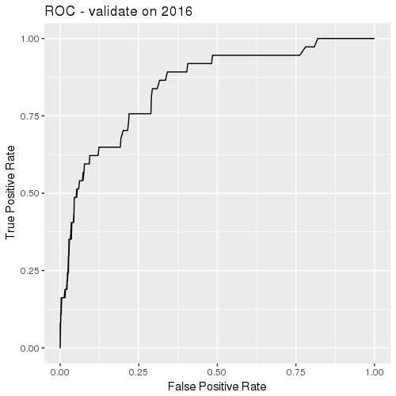
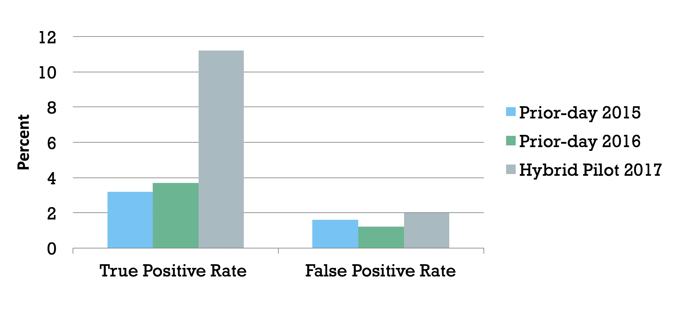
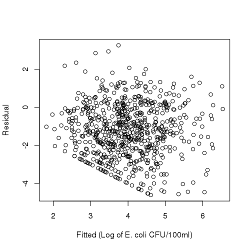
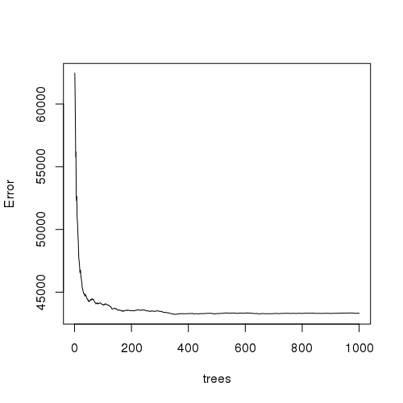

```{r setup_environment, echo=FALSE, fig.show='hide', results='hide', message=FALSE, warning=FALSE}
## Install necessary packages

library(knitr)
library(knitcitations)
library(heatmaply)
library(data.table)
webshot::install_phantomjs()

## Read bibliography
biblio <- read.bibtex("zotero-references.bib")
options("citation_format" = "pandoc")

## Read data for tables / graphs
setwd(paste0(getwd(), "/clear-water"))
source("Master.R")
```

# Introduction

Managers of recreational beaches use culture-based methods to monitor bacteria levels at recreational beaches. Sampling is conducted early in the morning, but results take upward of 12 hours `r citep(biblio["kinzelman_enterococci_2003"])`.  Between the time of sampling and subsequent results, beach conditions will often change so the water sample is not relevant to today's beach conditions `r citep(biblio[c("whitman_interaction_1999","boehm_decadal_2002")])`. To get around this, researchers have developed statistical models--dubbed "nowcast" models--to estimate water quality conditions for the day based on the previous day _E. coli_ levels and factors such as precipitation, wind, and water conditions `r citep(biblio["francy_developing_2013"])`.

These models often incorrectly predict that beaches will not have elevated bacteria levels--known as Type II errors or "false negatives" `r citep(biblio[c("nevers_efficacy_2011", "rabinovici_economic_2004", "boehm_decadal_2002")])`. For instance in 2015, Chicago beaches had 200 events where bacteria levels were too high; however, only 13 (6.5%) of these "beach days" were forcasted by the predictive model. These models do have good overall fit, but elevated bacteria levels are statistically rare events and models often fail to predict them--known as low "sensitivity".

Meanwhile, scientists have developed new methods which measure bacteria levels in water with substantially less delay. _Enterococci_ quantitative polymerase chain reaction (qPCR) methods can determine bacteria levels within 3 to 4 hours and yield similar results as culture-based methods `r citep(biblio[c("haugland_comparison_2005","kinzelman_enterococci_2003")])`. The rapid turnaround lets managers determine warnings or closures based on tests within the same day instead of relying on statistical models.

However, this approach has a drawback of cost and equipment availability. qPCR testing can cost between 2 to 5 times more than traditional culture-based methods `r citep(biblio["bienkowski_dna_nodate"])`. Thus, managers are faced with a dilemma of choosing between expensive qPCR methods or choosing slower culture-based methods and using predictive models to produce swim advisories.

Both of these tests have generally-acceptable thresholds for acceptable bacteria levels. Acceptable levels for culture-based methods should not exceed 235 CFU/100 ml while acceptable levels for qPCR testing should not exceed 1,000 cell equivalents (CE) `r citep(biblio["byappanahalli_linking_2010"])`. These rules can be leveraged to create a new predictive model which mixes the short turn-around of qPCR with statistical models to produce swim advisories.

We exploit the historical correlation between beaches to estimate water quality readings. We use limited qPCR results at specific beaches to predict elevated bacteria levels at other beaches using clustering algorithms and random forest regressions. This hybrid approach allows limited deployment of qPCR equipment to reduce overall costs but provides a higher quality statistical model.

We use 10 years of historical measurements from 20 beaches in Chicago to create a model to forecast whether bacteria levels at a beach will be elevated. During the summer of 2017, the model was able to increase the accuracy of prediction of beaches by 250 percent. Meanwhile, the model did not increase the rate of falsely identified days of high bacteria levels (known as Type I errors or "false positives"). 

# Prior-day Nowcast Models

Timing is a crucial factor for monitoring bacteria levels. We've adopted the typical shorthand to denote time periods by $t$ to denote now; $t-1$, $t-2$, $t-n$ to denote last period, two periods ago, and _some_ periods ago; and $t+1$, $t+2$, $t+n$ to denote the next period, two periods from now, and _some_ period in the future. For the purposes of this paper, we often use $t$ to denote _today_, $t-1$ to denote _yesterday_, and $t+1$ to denote _tomorrow_.

The defining characteristic of prior-day nowcast models is using _E. coli levels from the previous day ($t-1$) to predict bacteria levels for the current day ($t$). Models will also incorporate covariates or predictors to improve the accuracy of models, such as precipitation `r citep(biblio[c("ackerman_relationship_2003", "morrison_receiver_2003")])`, sunlight `r citep(biblio["whitman_solar_2004"])`, wind `r citep(biblio[c("smith_effect_1999", "olyphant_elements_2004")])`, wave and tidal levels `r citep(biblio[c("le_fevre_role_2003", "crowther_relationships_2001")])`, lake levels `r citep(biblio["francy_testing_2009"])`, turbidity `r citep(biblio["olyphant_characterization_2003"])`, and density of humans and animals `r citep(biblio[c("boehm_tiered_2003","reeves_scaling_2004")])`.

These models rely on prior-day data since culture-based testing is not available until upward of 12 hours after the samples were collected. The prediction at beach $x_i$ at time $t$ is dependent on the prior periods culture-based results, $x_i^{t-1}$ and other covariates, $w_1, w_2, ..., w_j$. These models often take the form of

$$ x_i^t = f \left( x_i^{t-1}, w_1, w_2, ..., w_j \right) $$

where $f(...)$ is a some function or algorithm that inputs raw data and outputs a probability. For instance, the linear regression model is typically $x_i^t = \beta_1 x_i^{t-1} + \beta_2 w_1 + \beta_3 w_2 + ... + \beta_j w_j$, where $\beta_j$ are the coefficients that weight the importance of each input. 

Various models are used to improve accuracy, such as log transformations `r citep(biblio["nevers_nowcast_2005"])`, polynomial coefficients `r citep(biblio["frick_nowcasting_2008"])`, logistic regression, partial least squares `r citep(biblio["hou_enterococci_2006"])`, generlized boosted regression modeling `r citep(biblio["cyterski_virtual_2014"])`, random forest, and genetic algorithm approaches `r citep(biblio["brooks_predicting_2016"])`. This class of models often has the same structure of using E. coli levels from time $t-1$--the prior-day--and covariates from time $t$ to predict beaches at time $t$.

Yet, the reliance on prior-day bacteria levels are likely the source of inaccuracy. The cause of elevated levels is unlikely to persist between days. Covariates can help determine when conditions are optimal for bacteria growth, but are still imprecise. Importantly, most statistical models are tuned to maximize overall accuracy (e.g., high $R^2$), but elevated bacteria levels are often rare events. Thus, models frequently have low sensitivity; that is, the ratio of accuracy estimated elevated bacteria levels over instances of actual exceedences. 

## Chicago Prior-day Nowcast Model

Chicago Park District measures water quality of 20 beaches along 26 miles against Lake Michigan on Chicago's eastern shore. There is no single source of bacteria in Lake Michigan, but likely introduced by birds, beaches, and people. The Chicago river is continguous to Lake Michigan, but a lock limites water flowing into the lake. The lock is sometimes opened--less than once per year--but beaches are immediately closed. 

Beaches operate between Memorial Day weekend through Labor Day -- approximately 122 days. As a result, there are approximately 2,440 "beach days", which each represent an observation in the model. An individual beach may have a warning when bacteria levels have exceeded acceptable thresholds. 

Between 2011 and 2016, Chicago Park District placed hydrometeorological sensors to automatically collect covariates on water and atmospheric conditions. Buoys were installed at five Chicago beaches--Foster, Montrose, Oak, 63rd Street, and Calumet--to collect turbidity, wave height, wave period, water temperature, and depth of the sensor. Weather stations were installed at three beaches--Foster, Oak, and 63rd Street--and collected wind direction, wind speed, air temperature, rainfall, solar radiation, relative humidity, and barometric pressure. Data was collected from the hydrometeorological sensors between every 2 and 5 minutes through the summer and aggregated.

Water samples were collected for culture-based testing each morning and recorded, usually around noon. Sampling was done on weekdays; however, weekend and holiday sampling was conducted if the prior readings were elevated or if the weekend was particularly busy.

`r citet(biblio["shively_prototypic_2016"])` used this data to build a prior-day nowcast model which used the prior-day culture tests and same-day hydrometeorological data to predict bacteria levels at all beaches. The novel model leveraged the sensors to automate the management process by providing estimates to beach managers each weekday.

The analytical model used the structure from Equation 1, where $f( \dots )$ was a random forest model. Once predictions were obtained, they were published online for beach visitors. In 2015 and 2016, the overall accuracy was 90% and 93%, respectively, and specificity (true negative rate) was 98% and 99 percent. However, the sensitivity (true positive rate) was only 3% and 4 percent. 

Beginning in 2015, Chicago Park District began to use limited qPCR testing at five beaches. Data was collected but not incorporated into the predictive model. During the summer of 2017, qPCR testing was expanded to all 20 beaches and culture-based testing was paused.

# Hybrid Nowcast Model

`r citet(biblio["whitman_summer_2008"])` observed that bacteria levels at Chicago beaches often fluctuate with each other on the same day where extreme highs and extreme lows were simultaneous for most beaches. Figure 1 shows the correlation between beaches from 2006 through 2017. The branches denote the "nearest neighbor" for each pair of beaches, a simple way to show similar beaches. 

```{r correlation_heatmap, echo=FALSE, fig.height=10, fig.width=12, results='hide', message=FALSE, warning=FALSE}

## Generate Correlation Heatmap of Beaches

dt <- data.table(df)
beachCor <- dcast(dt, Date ~ Client.ID, fun.aggregate = mean, value.var = "Escherichia.coli")
beachCor <- na.omit(beachCor)
beachCor <- log(beachCor[,c(2:21)])
corTable <- cor(beachCor)
corTable <- round(corTable, 2)
heatmaply_cor(corTable, file = "img/correlation-heatmap.png")
file.remove("img/correlation-heatmap.png")
```


Beaches are not uniformally correlated. Some beaches display strong clusters of correlation that exceed the correlation of bacteria readings within the same beach between days. By using strategic qPCR readings at selected beaches, we will be able to determine bacteria levels at other beaches.


Beaches are placed into clusters where bacteria levels are highly correlated, but readings between clusters is low. A clustering algorithm, $J\left( \dots \right)$, can assign beaches, $x_i$, to a cluster $k$ based on correlation between historical bacteria levels:

$$ K = J \left( x_1^t, x_2^t, \dots, x_n^t \right) $$
We select a feature beach, $\hat{x}_i^t$, in each cluster to predict the bacteria levels for the remaining $m$ beaches in the cluster, $x_i^t$. Thus, each cluster ($k$) will have the following membership: $K_i: \{ \hat{x}_1^t, x_1^t, x_2^t, \dots, x_m^t \}$.

To generate the predictions, we can formulate a model similar to equation 1, but limits predictions to each cluster:

$$ x_{i \in k}^t = f \left( \hat{x}_{i \in k}^t \right) $$
so the feature beach $\hat{x}_{i \in k}^t$ in the $i^\textrm{th}$ cluster $k$ uses data from time $t$ to predict the remaining beaches ($x_{i \in k}^t$) in the same cluster in the same time period.

Unlike equation 1, this model leverages uses observations from the same time $t$ to predict bacteria levels at the other beaches on the same day. The rapid results from qPCR testing allows recreational beach managers to observe beach readings at selected beaches, $\hat{x}_{i \in k}^t$, to predict bacteria levels at other beaches. The factors and conditions which led to elevated levels are captured and preserved in the model to render predictions.

## Identifying Beach Clusters

We apply the above approach to Chicago's beach data. We used K-means near clustering algorithm to detect when beaches have similar movements. First, there is an initial, random guess for which beaches belong in clusters. The distance or error is then measured for all clusters. Then, membership of clusters is slightly altered, the error is then measured and determined if the error is increasing or decreasing. This process is repeated until the lowest measured error is obtained.

Mathematically:

$$ J(x_k, y_k) = \sum_{i=1}^{k} \sum_{x_i \in B_k} ||x_i - \mu_k||^2 $$

We chose to limit to 5 clusters ($k = 5$) because it aligned to the number of qPCR testing sites by Chicago Parks District starting in 2015. K-means was applied to beaches based on latitude, longitude, total E. coli exceedances, and length of the longest breakwater. Each of these variables was scaled and centered by calculating z-scores prior to clustering. 

Some beaches were removed from the clustering because they were historical outliers for bacteria levels or had distinct physical features. Namely, we removed beaches that have lengthy breakwaters which have an impact on bacteria levels at those beaches. We tested this hypothesis by measuring the distance of the southernmost part of the beach to the northeasternmost edge of the breakwater. The correlation between the breakwater and bacteria exceedances between 2006 and 2017 were positive ($R^2$ = 0.54). We removed 63rd Street, Rainbow, Montrose, and Ohio, which have long breakwaters or a similar feature. 

Likewise, our earlier analytical modeling showed that beaches with a high frequency of high bacteria levels often confounded the model. Calumet, which had high exceedances as well as a medium-sized breakwater, was also removed from the analytical model. These 5 removed beaches comprised two of the clusters from the K-means analysis.

The final list of beaches and their respective clusters are listed in Table 1.

|      $k$      |    Cluster 1  |   Cluster 2   | Cluster 3 | Cluster 4 |   Cluster 5  |
|---------------|---------------|---------------|-----------|-----------|--------------|
| $\hat{x}$     |    Foster^    | North Avenue^ |   Leone^  |    31st^  | South Shore^ |
| $x_{1 \in k}$ |    Osterman   |   Oak Street  |  Juneway  |    12th   |    57th      |
| $x_{2 \in k}$ |               |               |   Howard  |    39th   |              |
| $x_{3 \in k}$ |               |               |   Rogers  |           |              |
| $x_{4 \in k}$ |               |               |   Jarvis  |           |              |


Table 1: Final results of K-means clustering. ^ denotes feature beaches used to predict remaining beaches in the cluster.

Within each cluster, the beach with the most _E. coli_ exceedances was selected to be feature beach and rapid testing as model input. By rapid testing the beaches with the most frequest exceedances, we capture an added operational benefit of maximizing the number of correct advisories. The remaining beaches were selected to be predicted by the model.

## Building the Predictive Model

A random forest regression model was trained with the predicted beach's name and 10 years of culture-based test results for each of the feature beaches. Variable importance for the random forest model was assessed by calculating the percentage increase in mean squared error (MSE) as a result of permuting the values for each variable (See Figure 2). The most important feature was the E. coli level at Leone Beach. In fact, the importance of each beach's E. coli level decreased as the beach location was further south. This is likely due to the fact that more beaches on the north side (10) are being predicted than on the south side (5).

#variable importance plot

```{r variable_importance, echo=FALSE, fig.height=10, fig.width=12, results='hide', message=FALSE, warning=FALSE}
varImpPlot(model, main = "", type=1)
```

The name of the beach being predicted had the lowest importance. Without this predictor, the predicted E. coli for a specific day would be the same for each beach. Indeed, because of the correlation that exists between certain beaches, it is not surprising that beach identity would rank last against the importance of E. coli levels along the whole lakefront. Still, permuting the beach name variable led to a 15.6% increase in the MSE.

The random forest regression model fit predicted E. coli levels in CFU/100ml units. These raw levels were transformed to a binary advisory decision, as explained below. A plot of the log of the raw fitted values vs. residuals shows random variation as seen in Figure 3, suggesting a good model fit without unexpected patterns. Due to left censoring at 1 CFU/100ml and an abundance of low E. coli readings, a limit can be observed at the lower left portion of the plot.

As the number of trees in the random forest model grew, model error decreased until around 400 trees. No performance benefit was observed beyond 400 trees, as shown in Figure 4.

## Validation

The model was tuned and validated using leave-one-year-out cross validation, in which the validation set consisted of all the observations in one year, and the training set consisted of all other observations. The process was repeated until each year had been in the validation set. The year 2016 was left out as a final validation set.

Historically, the Chicago prior-day model from 2015 through 2016 had a false-positive rate of 1.8 percent. That is, the model falsely predicted elevated bacteria levels 1.8 percent of all beach days over the course of the summer--typically 30 beach-days per season. We chose to align the parameters of our model to this historical false-positive rate. As Figure 5 shows, we could increase the number of times we correctly predict elevated bacteria levels, but it comes at a cost of also increasing the number of days we provide unnecessary warnings to beach-goers.

Figure 5 shows the receiver operating characteristic (ROC), which shows the trade-off between increasing the number of days with true predictions versus days with falsely identify elevated levels. By constraining the model to only have a 1.8 percent false-positive rate, the true positive rate is forecasted to be 22 percent.



A threshold was chosen to transform the model prediction to a binary outcome. To keep the model's false positive rate (FPR) near 1.8 percent, the threshold within each year that corresponded to a 1.8 percent was noted, and the mean threshold was then used to generate predictions for the holdout validation set. 

# Pilot

The pilot analytical model was created using historical data from 2015 and 2016. However, to correctly assess the accuracy of the model, we need to use out-of-sample predictions. As can happen with machine learning, it is possible that the accuracy of the model was caused by the analysts tuning the model to fit existing data and accompanying noise. Fitting existing data too well can lead to the model failing to accurately predict when encountering new data.

qPCR testing was piloted in 2015 and 2016; it was implemented at all 20 beaches during the summer of 2017. Culture-based methods were phased-out in 2017 and no longer collected. We used the clusters listed in Table 1 and model described in Figure 1

In summer 2017, the model concept was piloted with some limitations imposed by available data. The feature beaches were Calumet, Rainbow, South Shore, 63rd Street, and Montrose, and the predicted beaches were the other 15 regularly tested beaches. The model was trained using qPCR test results for 2015 and 2016 and fit to predict the culture-based levels for the predicted beach on the same day. An application was developed and deployed which regularly checked Chicago's public data portal for qPCR results for the feature beaches. Every day during the summer, once all the qPCR results were posted, the application automatically ran the model and uploaded the predictions on the public data portal within five minutes.

Beginning on Friday, May 26, water samples were collected by the Chicago Park District and qPCR testing was completed by the University of Illinois at Chicago. Those results were then posted to the City of Chicago Data Portal--typically around noon. About 5 minutes later, we posted the predictions based on our model to the Data Portal. The last predictions and samples were conducted on September 4th. While qPCR data was available for all beaches, we ignored any qPCR reading except of the feature beaches listed in Table 1.

Both predictions and samples were collected each day during the week. This process was different from prior years where samples were usually collected only during weekdays and non-holidays, except when levels had been elevated on the previous Friday or it was suspected to be a busy weekend on the beaches.

To translate the predicted E. coli level to an advisory decision, the threshold level used to validate the original model was 381 CFU/100ml. Table 3 shows the confusion matrix for the results of the pilot. Each quadrant shows the relationship between the prediction (whether the model provided an advisory) versus the actual results from qPCR testing (whether there were levels above 381 CFU/100ml). We compared whether our model predicted elevated bacteria levels compared to the results from the actual test results.

## Results

Over the summer, the analytical model had a sensitivity (true positive rate) of 11.2 percent compared to a sensitivity of 3.2 percent in 2016 (Table 2). From 2015 through 2016, the historical average true positive rate for those beaches was 3.3 percent. That is, the hybrid model increased the true positive rate by 250 percent over the historical average. 



In terms of impact on beachgoers, the hybrid model issued 90 correct advisories while there were 71 incorrect advisories. While we cannot directly compare it to the Chicago prior-day models, in 2016 that model issued 12 correct advisories while issuing 184 incorrect advisories. Likewise in 2015, the prior-day model issued 14 correct advisories versus 184 incorrect advisories.

Overall, accuracy of the hybrid nowcast model is in line with the previous performance of the Chicago prior-day nowcast model. Since most days do not have elevated _E. coli_ levels, the increase in sensitivity (true positive rate) does not make a major impact on overall accuracy.

|     Model       | Specificity | Sensitivity | Precision | Accuracy |
|-----------------|-------------|-------------|-----------|----------|
| 2017 Hybrid     |    98.0%    |    11.2%    |           |  92.6%   |
| 2016 Prior-day  |    98.9%    |    3.7%     |           |  93.0%   |
| 2015 Prior-day  |    98.4%    |    3.2%     |           |  89.4%   |

Table 2: Comparing specificity, sensitivity, and accuracy between Hybrid and Prior-day Nowcast Models.

Meanwhile, the false positive rate was slightly higher at 2.0 percent during 2017. Our target rate was 1.8 percent to remain consistent with prior summers, but specificity (true negative rate) fell slightly. In total, the hybrid model identified 24 days as having elevated levels, when the actual bacterial level was normal.

# Discussion

The hybrid nowcast model preserves temporal readings of _E. coli_ levels at select beaches where qPCR testing is available and uses historial correlations between beaches to forecast bacteria levels where readings are not available. In the summer of 2017, the hybrid model correctly raised warnings by 250 percent while only marginally increasing "false negatives" (type II errors) by two-tenths of a percent.

The difference in performance is likely due to the use of bacteria levels on the same day. Chicago beaches rarely encounter consecutive days of elevated bacteria levels, so prior-day readings do not predict elevated levels on the next day. The factors that cause bacteria levels to grow rarely persist between days as few beaches have consecutive days of beach warnings. However, elevated bacteria levels portend ideal conditions for bacteria in other beaches.

Although Chicago was able to deploy qPCR testing at all 20 beaches, the cost and complexity of qPCR equipment limits widescale deployment. For instance, the lab conducting qPCR testing for Chicago has no remaining equipment to expand testing to other beaches or to recreational beaches along the Chicago river. The hybrid model presented in this paper allows beach managers to balance the constraints of qPCR equipment with beachgoer safety.

We removed ten beaches from this model because of physical characteristics, such as long breakwaters, that prevented them from being clustered with other beaches; one beach was removed due to frequently high readings; and we used 5 beaches to predict bacteria levels. As a result, 10 total beaches would need to undergo qPCR testing and ten beaches would be able to forgo any testing.

This model selected feature beaches that were prone to elevated bacteria levels, Foster, North Avenue, Leone, 31st, and South Shore. Moreover, we removed Calumet from the model since it frequently had elevated levels. qPCR testing can be deployed to the worse behaved beaches and rely on statistical models for the remaining beaches. This will naturally improve model performance since beaches which comprise the mode number of issues will be accurately measured, leading to more accurate beach warnings.

These results did not include any other covariates to help predict performance at other beaches. Initial attempts to include information---such as weather, air and water temperature, turbidity, etc.---did not improve overall model performance. This can be explored further to see if covariates or if other models besides random forest can improve model performance.

While this paper showed a 250% increase in sensitivity to 11%, the ability to predict elevated bacteria levels is still relatively low. Sensitivity can be significantly improved, but at a cost of increasing the rate of false positives which is an inconvenience for beachgoers. However, there is a lack of guidelines or studies which provide guidelines for acceptable levels of false positives. Our target rate of 1.8% was determined based on prior years, but it may prove worthwhile to incorrectly predict additional beach warnings if it deters exposure to bacteria.

# Acknowledgements

We are indebted to Chicago Park District staff, including Cathy Breitenbach and Carol Kim, who provided incredible guidance and feedback while taking time to work with the research team. Meredith Nevers graciously provided the research team with her considerable expertise. This was a unique project initiall developed by a team of volunteers. We are grateful for Chi Hack Night which provided a forum for the volunteers to contribute to this project. In particular, we thank Forest Gregg who helped spur this project. We appreciate Jonathan Levy's work to publish the necessary data to make it available to the research team and the public. Finally, we wish to thank the attendees of State of Lake Michigan conference in 2017 for their comments and feedback.

# Supplementary Materials

## Data and Source Code

Source code for the statistical model is available at XXXXXX. Raw data from beach readings (XXXXX) and historical forecasts generated by the hybrid nowcast model (XXXXX) are publicly available and updated during the beach season. We encourage others to review all the data and code and appreciate any feedback, notes, or suggestions for improvement.

## Graphs and Figures

|         Variable          | Percent Increase in MSE |
|---------------------------|-------------------------|
|        Beach Name         |          15.56          |   
|   Foster E. coli Level    |          43.48          |   
| North Avenue E. coli Level|          29.32          |   
|    31st E. coli Level     |          27.46          |   
|    Leone E. coli Level    |          43.73          |   
| South Shore E. coli Level |          21.34          |   

Table S1: Variable Importance.

\pagebreak



\pagebreak



|    2017 Pilot   | Predicted Elevated | Predicted Normal |
|-----------------|--------------------|------------------|
| Actual Elevated |     9 (11.2%)      |    71 (88.8%)    | 
| Actual Normal   |     24 (2.0%)      |   1,186 (98.0%)  |

Table S2: Hybrid model 2017 pilot results.

\newpage


# References

```{r references, echo=FALSE, message=FALSE}
write.bibtex(file="bibliography.bib")
```

