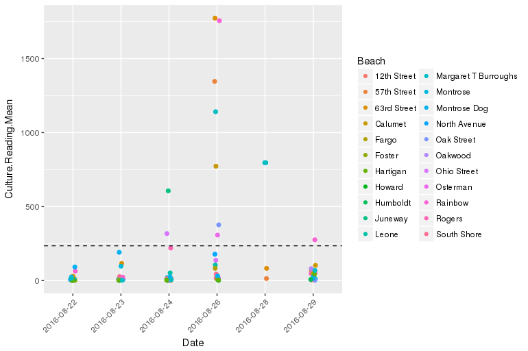

```{r setup_environment, echo=FALSE, results='hide', message=FALSE, warning=FALSE}
## Install necessary packages

library(knitr)
library(knitcitations)

## Read bibliography
biblio <- read.bibtex("zotero-references.bib")
options("citation_format" = "pandoc")


```

> Culture-based methods to measure Escherichia coli (E. coli) are used by beach administrators to inform whether bacteria levels represent an elevated risk to swimmers. However, these methods take up to 12 hours for processing. Statistical models are used to forecast bacteria levels in lieu of test results. Often, these results underestimate days with elevated E. coli levels. In Chicago, these models only accurately predicted elevated levels 6.5% percent of the time in 2015.
> EPA approval of enterococci quantitative PCR (qPCR) methods allows for testing that is available within 3 hours, eschewing the need for predictive models. Unfortunately, these “rapid testing” methods are 100% to 400% more expensive than culture-based methods.
> This paper presents a prediction model which uses limited deployments of “rapid testing” sites with inter-beach correlation to predict when bacteria will exceed acceptable thresholds. The model can be used to inform management decisions on when to warn or close beaches due to exposure to the bacteria. Using data from Chicago, we find that the approach would have issued accurate advisories for 90 poor water quality “beach days” compared to 15 advisories issued by the previous model. The accuracy of the model rose from 3.2% to 11.2%--a 250% increase.


# Introduction

Managers of recreational beaches use culture-based methods to monitor bacteria levels at recreational beaches. Sampling is conducted early in the morning, but despite those efforts, results take upward of 12 hours `r citep(biblio["kinzelman_enterococci_2003"])`.  Between the time of sampling and subsequent results, beach conditions will often change so the water sample is not relevant to today's beach conditions `r citep(biblio[c("whitman_interaction_1999","boehm_decadal_2002")])`. To get around this, researchers have developed statistical models to estimate water quality conditions for the day `r citep(biblio["francy_developing_2013"])`. These models account for the past trend at the beaches and other factors such as precipitation, wind, and water conditions.

Yet, these models usually do not correctly identify days with elevated bacteria levels (known as Type II errors or "false negatives") `r citep(biblio[c("nevers_efficacy_2011", "rabinovici_economic_2004", "boehm_decadal_2002")])`. For instance in 2015, Chicago beaches had 200 events where bacteria levels were too high; however, only 13 (6.5%) of these events were forcasted by the predictive model. As we will discuss, these models do have good overall fit, but elevated bacteria levels are statistically rare events and models often fail to predict them.

Meanwhile, scientists have developed new methods which measure bacteria levels in water with substantially less delay. _Enterococci_ quantitative polymerase chain reaction (qPCR) methods can determine bacteria levels within 3 to 4 hours and yield similar results as culture-based methods `r citep(biblio[c("haugland_comparison_2005","kinzelman_enterococci_2003")])`.

However, this approach has a drawback of cost and equipment availability. qPCR testing can cost between 2 to 5 times more than traditional culture-based methods `r citep(biblio["news_dna_nodate"])`. Thus, managers are faced with a dilemma of choosing between expensive qPCR methods or choosing slower culture-based methods and using predictive models to produce swim advisories.

While culture-based and qPCR measure two completely different markers for bacteria, both of these tests have generally-acceptable thresholds for acceptable bacteria levels. Acceptable levels for culture-based methods should not exceed 235 CFU/100 ml while acceptable levels for qPCR testing should not exceed 1,000 cell equivalents (CE) `r citep(biblio["byappanahalli_linking_2010"])`. Within the context of beach management, these rules can be leveraged to create a new predictive model which mixes the short turn-around of qPCR with statistical models to produce swim advisories.

This paper proposes a hybrid model which uses readily available results from qPCR testing at select beaches to predict whether bacteria levels will be high at other beaches. We exploit the historical correlation between beaches to estimate water quality readings based solely on qPCR results that are available on the same day. This approach allows limited deployment of qPCR equipment to reduce overall costs but provides a higher quality statistical model. As a result, these predictions can be used to "nowcast" water quality conditions.

This method eschews time-series based methods, which seem unreliable between summers and, as mentioned, fail to predict when bacteria levels are too high. This paper discusses attempts to formulate time-series models--including the introduction of ensemble models--but we conclude that time-series models often exhibit inconsistency between beach seasons and relatively low rates of true positives and high rates of false negatives.

We find that the hybrid model is more accurate and consistent between seasons. Using data from 20 beaches managed by the Chicago Park District, we use 10 years of historical measurements to create a model to forecast whether bacteria levels at a beach will be elevated. During the summer of 2017, a operationalized version of the model was able to increase the accuracy of prediction of beaches by 250 percent. For years which recorded data exist (2015 - 2016), the existing predictive model typically correctly suggested 15 advisories. In 2017, the piloted process, using selective rapid testing and predictive modeling, correctly suggested 90 advisories. Meanwhile, the model did not increase the rate of falsely identified days of high bacteria levels (known as Type I errors or "false positives"). 

# Background

Timing is a crucial factor for monitoring bacteria levels. We've adopted the typical shorthand to denote time periods by $t$ to denote now; $t-1$, $t-2$, $t-n$ to denote last period, two periods ago, and _some_ periods ago; and $t+1$, $t+2$, $t+n$ to denote the next period, two periods from now, and _some_ period in the future. For the purposes of this paper, we often use $t$ to denote _today_, $t-1$ to denote _yesterday_, and $t+1$ to denote _tomorrow_.

## Prior-day Nowcast Model

Researchers have developed forecasting models using prior bacteria testing results at beaches and other available data such as precipitation `r citep(biblio[c("ackerman_relationship_2003", "morrison_receiver_2003")])`, sunlight `r citep(biblio["whitman_solar_2004"])`, wind `r citep(biblio[c("smith_effect_1999", "olyphant_elements_2004")])`, wave and tidal levels `r citep(biblio[c("le_fevre_role_2003", "crowther_relationships_2001")])`, lake levels `r citep(biblio["francy_testing_2009"])`, turbidity `r citep(biblio["olyphant_characterization_2003"])`, and density of humans and animals `r citep(biblio[c("boehm_tiered_2003","reeves_scaling_2004")])`.

These models rely on prior-day data since culture-based testing is not available until upward of 12 hours after the samples were collected. The prediction at beach $x_i$ at time $t$ is dependent on the prior periods culture-based results, $x_i^{t-1}$ and other covariates, $w_1, w_2, ..., w_j$. These models often take the form of

$$ x_i^t = f(x_i^{t-1}, w_1, w_2, ..., w_j) $$

where $f(...)$ is a some function or algorithm that inputs raw data and outputs a probability. For instance, the linear regression model is typically $x_i^t = \beta_1 x_i^{t-1} + \beta_2 w_1 + \beta_3 w_2 + ... + \beta_j w_j$, where $\beta_j$ are the coefficients that weight the importance of each input. But, models often use log transformations `r citep(biblio["nevers_nowcast_2005"])`, polynomial coefficients `r citep(biblio["frick_nowcasting_2008"])`, logistic regression, partial least squares `r citep(biblio["hou_enterococci_2006"])`, generlized boosted regression modeling `r citep(biblio["cyterski_virtual_2014"])`, random forest, and genetic algorithm approaches `r citep(biblio["brooks_predicting_2016"])`. This class of models often has the same structure of using E. coli levels from time $t-1$--the prior-day--and covariates from time $t$ to predict beaches at time $t$.

`r citet(biblio["shively_prototypic_2016"])` implemented a model which automatically collected covariates on water and atmospheric conditions (e.g., water temperature, turbidity) through hydrometeorological sensors placed in the water and on shore. This technology allowed automated "nowcasts" of beaches to rely on prior-day bacteria levels and current water and atmospheric conditions. Moreover, it allowed the automation of forecasts based on available data.

# Statistical Models

## Existing Methodology

One of the first automated prior-day nowcast models was developed by `r citet(biblio["shively_prototypic_2016"])`. Between 2011 and 2016, Chicago Park District teamed with scientists to use this model (hereafter to as "Chicago prior-day model") to forecast elevated bacteria levels in Lake Michigan. It used air and water sensors to estimate the covariates, $w_i$, that indicate future levels of bacteria and culture-based measurements of bacteria for the previous day, $x_{t-1}$.

Buoys were installed at five Chicago beaches--Foster, Montrose, Oak, 63rd Street, and Calumet--to collect turbidity, wave height, wave period, water temperature, and depth of the sensor. Weather stations were installed at three beaches--Foster, Oak, and 63rd Street--and collected wind direction, wind speed, air temperature, rainfall, solar radiation, relative humidity, and barometric pressure. Data was collected from the hydrometeorological sensors between every 2 and 5 minutes through the summer and aggregated.

Similar to other models discussed, it used a multivariate model between covariates and the log of _E. coli_ measured at each beach. The authors used a regression tree to determine the factors that portend elevated _E. coli_ levels. Once predictions were obtained, they were published online for beach visitors at cpdbeaches.com and archived online at data.cityofchicago.org. 

## Ensemble Modeling

Typically, previous research has only explored one of the above models or compared individual models `r citep(biblio["brooks_predicting_2016"])`. In this section, we explore various different prior-day nowcast models and use ensemble modeling techniques to combine various statistical and machine-learning models. Ensemble models allows two or more models to be combined to yield predictions. This allows weaknesses from any single model to be mollified by other statistical models. Often, this yields better and more stable predictions.[^1]

...


## Hybrid Model

The proposed hybrid model relies on the observed correlation of bacteria level between beaches, as suggested by `r citet(biblio["whitman_summer_2008"])`. Bacteria levels at Chicago beaches often fluctuate with each other on the same day where extreme highs and extreme lows were simultaneous for most beaches (figure 1). It is therefore possible to use selected sampling at each beach to infer bacteria levels at other beaches were sampling was not available.



Hybrid modeling uses selected observations ($x_i^t$) from today $t$ at some ($n$) beaches, that is $X^t: x_1^t, x_2^t, ..., x_n^t$, to forecast bacteria levels $y_i^t$ at other ($m$) beaches: $Y^t: y_1^t, y_2^t, ..., y_m^t$. In order to derive the predictions, we first detemine clusters, $J(c_k)$ of beaches which have similar bacteria levels. Each cluster contains at least one beach to be sampled each day while the rest of the beaches are not. Then, we use machine learning techniques to derive predictions for each beach based on qPCR data.

This hybrid model attempts to recast the research into a missing value problem. That is, from a research perspective, use information from the observed beaches to "fill-in" the data. Missing-value problems are common and often tackled in statistics in a variety of ways. For example, researchers can "fill-in" responses to surveys that were left partially blank. The general approach to missing-value problems is using observed correlations to fill-in missing values. 


### Identifying Beach Clusters

We used clustering techniques to determine groups of beaches that tend to move in tandem. Specifically, we identified beaches where bacteria levels and advisories are correlated with each other. We used K-means clustering algorithm to detect when beaches have similar movements. 

Given a number of desired clusters ($k$), the objective is to group a beach ($i$) with a cluster of other beaches ($B_k$) together that minimize the sum of squares. Mathematically:

$$ J(c_k) = \sum_{i=1}^{k} \sum_{x_i \in B_k} ||x_i - \mu_k||^2 $$

It is an algorithm which cannot be solved as a closed-form solution. Instead, the algorithm provides an initial guess for clusters and runs over multiple iterations to find the clusters which minimize the overall error. First, there is an initial, random guess for which beaches belong in clusters. The distance or error is then measured, $x_i - \mu_k$ for all clusters. Then, membership of clusters is slightly altered, the error is then measured and determined if the error is increasing or decreasing. This process is repeated until the lowest measured error is obtained.

We chose to limit to 5 clusters ($k = 5$) because it aligned to the number of qPCR testing sites by Chicago Parks District. K-means was applied to beaches based on latitude, longitude, total E. coli exceedances, and length of the longest breakwater. Each of these variables was scaled and centered by calculating z-scores prior to clustering. 

Some beaches were removed from the clustering because they were historical outliers for bacteria levels or had distinct physical features. Namely, we removed beaches that have lengthy breakwaters which have an impact on bacteria levels at those beaches. We tested this hypothesis by measuring the distance of the southernmost part of the beach to the northeasternmost edge of the breakwater. The correlation between the breakwater and bacteria exceedances between 2006 and 2017 were positive (R^2 = 0.54). We removed 63rd Street, Rainbow, Montrose, and Ohio, which have long breakwaters or a similar feature. Likewise, our earlier analytical modeling showed that beaches with a high frequency of high bacteria levels often confounded the model. Calumet, which had high exceedances as well as a medium-sized breakwater, was also removed from the analytical model. These 5 removed beaches comprised two of the clusters from the K-means analysis.

The remaining three clusters were reanalyzed using 5-cluster k-means with the same variables. 

| Cluster 1 |   Cluster 2  | Cluster 3 | Cluster 4 |  Cluster 5  |
|-----------|--------------|-----------|-----------|-------------|
|  Foster   | North Avenue |   Leone   |    31st   | South Shore |
| Osterman  | Oak Street   |  Juneway  |    12th   |     57th    |
|  Albion   |              |   Howard  |    39th   |             |
|           |              |   Rogers  |           |             |
|           |              |   Jarvis  |           |             |


Table 1: Final results of K-means clustering.

Within each cluster, the beach with the most _E. coli_ exceedances was selected to be rapid tested as model input. By rapid testing the beaches with the most frequest exceedances, we capture an added operational benefit of maximizing the number of correct advisories. The remaining beaches were selected to be predicted by the model.

| Feature Beaches (to be rapid tested) | Predicted Beaches |
|-----------------|-------------------|
|   South Shore   |       57th        |
|      31st       |       39th        |
|   North Avenue  |       12th        |
|     Foster      |     Oak Street    |
|     Leone       |     Osterman      |
|                 |      Albion       |
|                 |      Juneway      |
|                 |       Howard      |
|                 |       Rogers      |
|                 |       Jarvis      |

Table 2: Hybrid model features (inputs), and beaches to be predicted.

### Building the Predictive Model

A random forest regression model was trained with the following features: the predicted beach's name and 10 years of culture-based test results for each of the feature beaches. The model was fit to predict the culture-based result for the predicted beach on the same day. The model was tuned and validated using leave-one-year-out cross validation, in which the validation set consisted of all the observations in one year, and the training set consisted of all other observations. The process was repeated until each year had been in the validation set. The year 2016 was left out as a final validation set.

Historically, the Chicago prior-day model from 2015 through 2016 had a false-positive rate of 1.8 percent. That is, the model falsely predicted elevated bacteria levels 1.8 percent of all beach days over the course of the summer--typically 30 beach-days per season. We chose to align the parameters of our model to this historical false-positive rate. As Figure 2 shows, we could increase the number of times we correctly predict elevated bacteria levels, but it comes at a cost of also increasing the number of days we provide unnecessary warnings to beach-goers.

Figure 2 shows the receiver operating characteristic (ROC), which shows the trade-off between increasing the number of days with true predictions versus days with falsely identify elevated levels. By constraining the model to only have a 1.8 percent false-positive rate, the true positive rate is forecasted to be 22 percent.


A threshold was chosen to transform the model prediction to a binary outcome. To keep the model's false positive rate (FPR) near 1.8 percent, the threshold within each year that corresponded to a 1.8 percent was noted, and the mean threshold was then used to generate predictions for the holdout validation set. 

In summer 2017, the model concept was piloted with some limitations imposed by available data. The feature beaches were Calumet, Rainbow, South Shore, 63rd Street, and Montrose, and the predicted beaches were the other 15 regularly tested beaches. The model was trained using qPCR test results for 2015 and 2016 and fit to predict the culture-based levels for the predicted beach on the same day. An application was developed and deployed which regularly checked Chicago's public data portal for qPCR results for the feature beaches. Every day during the summer, once all the qPCR results were posted, the application automatically ran the model and uploaded the predictions on the public data portal within five minutes. 

### Validating the Algorithm - Summer 2017

The pilot analytical model was created using historical data from 2015 and 2016. However, to correctly assess the accuracy of the model, we need to use out-of-sample predictions. As can happen with machine learning, it is possible that the accuracy of the model was caused by the analysts tuning the model to fit existing data and accompanying noise. Fitting existing data too well can lead to the model failing to accurately predict when encountering new data.

Using the training data through 2016, we used the summer of 2017 to predict elevated levels and then measure the accuracy at the end of the season. This provided the same scenario as beach forecasting models: read the most recent data, formulate a prediction, collect water samples, and then compare the predictions to the collected samples. 

qPCR measurements from the 5 beaches noted above were used to predict the qPCR levels at the other 15 regularly tested beaches. Beginning on Friday, May 26, water samples were collected by the Chicago Park District and tested by the University of Illinois at Chicago. Those results were then posted to the City of Chicago Data Portal when they were publicly available--typically around noon. About 5 minutes later, we posted the predictions based on our model to the Data Portal. The last predictions and samples were conducted on September 4th. 

Both predictions and samples were collected each day during the week. This process was different from prior years where samples were usually collected only during weekdays and non-holidays, except when levels had been elevated on the previous Friday or it was suspected to be a busy weekend on the beaches.

To translate the predicted E. coli level to an advisory decision, the threshold level used to validate the original model was 381 CFU/100ml. Table 3 shows the confusion matrix for the results of the pilot. Each quadrant shows the relationship between the prediction (whether the model provided an advisory) versus the actual results from qPCR testing (whether there were levels above 381 CFU/100ml). 

2017 Pilot | Predicted Elevated | Predicted Normal
---|---|---
Actual Elevated | 9 (11.2%) | 71 (88.8%) |
Actual Normal | 24 (2.0%) | 1186 (98.0%) |

Table 3: Hybrid model 2017 pilot results.

Over the summer, the analytical model had a true positive rate of 11.2 percent compared to a true positive rate of 3.2 percent in 2016. From 2015 through 2016, the historical average true positive rate for those beaches was 3.3 percent. That is, the hybrid model increased the true positive rate by 250 percent over the historical average. Meanwhile, the false positive rate was slightly higher at 2.0 percent during 2017. Our target rate was 1.8 percent to remain consistent with prior summers. 


In terms of impact on beachgoers, the hybrid model issued 90 correct advisories while there were 71 incorrect advisories. While we cannot directly compare it to the Chicago prior-day models, in 2016 that model issued 12 correct advisories while issuing 184 incorrect advisories. Likewise in 2015, the prior-day model issued 14 correct advisories versus 184 incorrect advisories.

On the other hand, the hybrid model identified 24 days as having elevated levels, when the actual bacterial level was normal.

# Summary

# References

[^1]: By analogy, ensemble modeling is akin to asking a panel of experts instead of relying on a single expert.

```{r references, echo=FALSE, message=FALSE}
write.bibtex(file="bibliography.bib")
```
